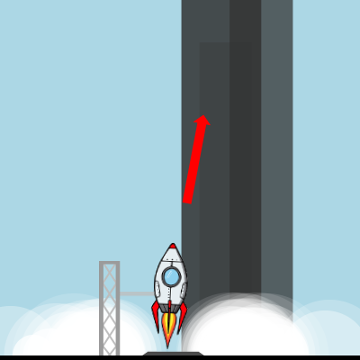

# Spaceship
A Spaceship simulator

**[See it here!](https://lenaindelaforetmagique.github.io/Spaceship/)**

## Screenshot!

## Controls
On regular computer:
* space bar to boost
* left/right arrow to rotate ccw/cw
* up/down to move forward/backward
* n to restart

On tactile devices:
* tap left-quarter of the screen to rotate ccw
* tap right-quarter of the screen to rotate cw
* tap the center of the screen to boost
